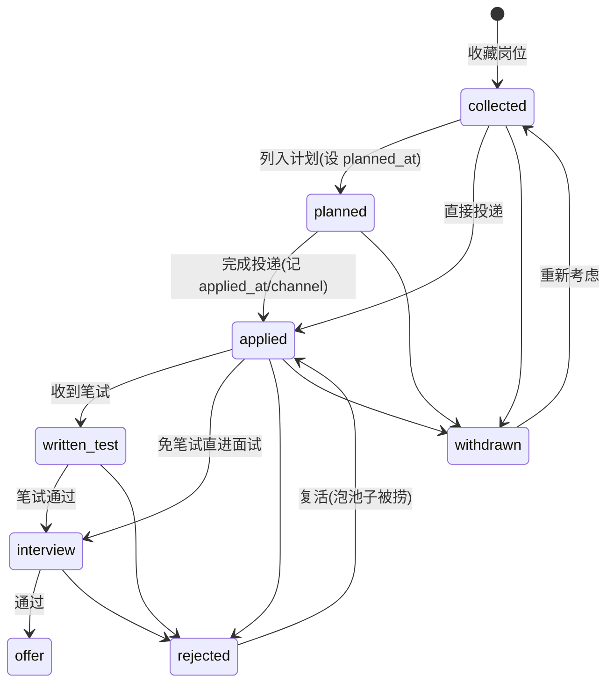

# JobRadar 数据模型

| 版本 | 日期 | 状态 |
|---|---|---|
| v0.2 | 2026-09-04 | 切换 PostgreSQL + pgvector 方言 |
| v0.1 | 2026-09-03 | 初稿（SQLite 方案，已废弃） |

数据库：PostgreSQL 16 + pgvector，ORM：Spring Data JPA (Hibernate 6)，迁移：Flyway（W1 即引入）。

## 1. ER 图

```mermaid
erDiagram
    companies ||--o{ jobs : has
    jobs ||--o| applications : "0..1 (一人一岗一投)"
    applications ||--o{ application_events : history
    jobs ||--o{ match_reports : evaluated_by
    resumes ||--o{ match_reports : evaluates
    jobs ||--o{ recommendations : recommended_in
    crawl_sources ||--o{ jobs : discovered

    companies {
        bigint id PK
        text name UK
        text company_type   "internet|soe_central|soe_local|institute|bank|operator|foreign|other"
        text tier           "dream|target|backup|none，用户目标分级"
        text homepage
        text notes
    }
    jobs {
        bigint id PK
        bigint company_id FK
        text title
        text jd_text
        text jd_summary     "LLM 摘要"
        jsonb requirements  "结构化要求（LLM 提取）"
        text city
        text salary_range
        text source_platform
        text source_url
        text dedupe_hash UK
        date publish_date
        date deadline
        vector_1024 embedding
        tsvector search_vector  "jieba 分词后写入"
        timestamptz created_at
    }
    applications {
        bigint id PK
        bigint job_id FK UK
        text stage
        text channel        "投递渠道"
        int priority        "1-5"
        date planned_at
        text next_action
        timestamptz next_action_at
        text notes
        timestamptz applied_at
        timestamptz created_at
    }
    application_events {
        bigint id PK
        bigint application_id FK
        text from_stage
        text to_stage
        text note
        timestamptz created_at
    }
    resumes {
        bigint id PK
        text name           "版本名，如 秋招v3-后端方向"
        text file_path
        jsonb parsed        "结构化简历 ResumeProfile"
        vector_1024 embedding
        boolean is_default
        timestamptz created_at
    }
    match_reports {
        bigint id PK
        bigint job_id FK
        bigint resume_id FK
        int score_total     "0-100"
        jsonb detail        "硬性核对+维度分+缺口+建议"
        text model_used
        text prompt_version
        timestamptz created_at
    }
    recommendations {
        bigint id PK
        bigint job_id FK
        bigint match_report_id FK
        date rec_date
        int rank
        text reason
        text status         "pending|accepted|ignored"
        text feedback_tag   "忽略原因标签，可选"
    }
    crawl_sources {
        bigint id PK
        text name
        text url
        text parser         "解析器标识"
        text category       "institute_military|operator|bank|soe_other|community"
        boolean enabled
        timestamptz last_crawled_at
        jsonb meta          "站点特定配置"
    }
```

另有 `weekly_goals(week_start PK, target_count, note)` 与 `settings(key PK, value jsonb)` 两张小表支撑投递规划与配置（含 LLM token 用量累计）。

**company_type 枚举说明**（v0.2 按目标雇主细化）：`internet`（互联网）、`institute`（军工/科研院所）、`operator`（运营商：电信/移动/联通）、`bank`（银行及软开中心）、`soe_central`/`soe_local`（其他央国企）、`foreign`、`other`。

## 2. 核心设计说明

### 2.1 jobs 与 applications 分离

- `jobs` 是**中立岗位库**：爬虫/插件/手动录入都只写 jobs，与用户行为无关。
- `applications` 是**我与岗位的关系**：仅当用户收藏/计划/投递时创建，`job_id` 唯一约束。
- 看板「收藏」列 = stage=collected 的 applications；「新发现」区 = 无 application 且近 48h 入库的 jobs。

### 2.2 去重

- `dedupe_hash = sha1(normalize(company_name) + normalize(title) + normalize(city))`
- normalize：去空白、全半角统一、公司名去后缀（有限公司/股份有限公司）、岗位名去括号备注。
- 军工所特别注意：**同一研究所存在多种称谓**（"航空工业计算所"/"中航工业631所"/"AVIC 计算所"），normalize 规则需内置一份别名映射表（随 target-sources.md 清单维护），先别名归一再算 hash。
- 撞 hash → 合并（补充 `source_url` 到 jobs.meta 的 `also_seen_on` 数组），不新建记录。

### 2.3 全文检索（tsvector 方案）

```sql
ALTER TABLE jobs ADD COLUMN search_vector tsvector
    GENERATED ALWAYS AS (to_tsvector('simple', search_text)) STORED;  -- search_text 为 jieba 分词拼接列
CREATE INDEX idx_jobs_fts ON jobs USING GIN (search_vector);
```

- 中文处理：应用层用 **jieba-analysis**（Java 分词库）对 `company_name + title + jd_text + city` 分词、空格拼接写入 `search_text` 列；查询侧同样分词后 `to_tsquery('simple', ...)` 匹配。
- 兜底：**pg_trgm** 扩展建 `company_name`、`title` 的 trigram GIN 索引，支撑公司名模糊匹配（如 MCP tool 里"腾讯"定位记录）。
- 语义搜索：独立于全文检索，走 pgvector 余弦距离。

### 2.4 向量存储与检索

```sql
CREATE EXTENSION IF NOT EXISTS vector;
-- embedding vector(1024)  -- bge-m3
CREATE INDEX idx_jobs_embedding ON jobs USING hnsw (embedding vector_cosine_ops);
```

- 粗筛 SQL：`ORDER BY embedding <=> :resumeVector LIMIT 20`，毫秒级返回。
- 生成时机：job 入库且 jd_text 非空时异步生成（Spring `@Async`，失败重试不阻塞入库）。
- embedding 模型固定 bge-m3（1024 维）；切换模型需全量重算，列上注释记录模型版本。

## 3. 投递状态机



**约定：**
- 流转不强制校验（允许跳阶段），但每次变更必须写 `application_events`——**留痕是硬约束**。
- 终态：`offer` / `rejected` / `withdrawn`；终态可回退（泡池子复活是真实场景；银行/研究所流程长，常有"默认被拒后被捞"）。
- `next_action` + `next_action_at`：自由文本 + 时间，Dashboard/日历/提醒统一读取。

## 4. 关键 DDL（PostgreSQL，节选）

```sql
CREATE TABLE companies (
    id BIGINT GENERATED ALWAYS AS IDENTITY PRIMARY KEY,
    name TEXT NOT NULL UNIQUE,
    company_type TEXT NOT NULL DEFAULT 'other'
        CHECK (company_type IN ('internet','soe_central','soe_local','institute','operator','bank','foreign','other')),
    tier TEXT NOT NULL DEFAULT 'none'
        CHECK (tier IN ('dream','target','backup','none')),
    homepage TEXT,
    notes TEXT,
    created_at TIMESTAMPTZ NOT NULL DEFAULT now()
);

CREATE TABLE jobs (
    id BIGINT GENERATED ALWAYS AS IDENTITY PRIMARY KEY,
    company_id BIGINT NOT NULL REFERENCES companies(id),
    title TEXT NOT NULL,
    jd_text TEXT NOT NULL DEFAULT '',
    jd_summary TEXT,
    requirements JSONB,                 -- JobRequirements schema，见 agent-design.md §3.2
    city TEXT,
    salary_range TEXT,
    source_platform TEXT NOT NULL,      -- boss|niuke|guopin|official|extension|manual
    source_url TEXT,
    dedupe_hash TEXT NOT NULL UNIQUE,
    publish_date DATE,
    deadline DATE,
    embedding vector(1024),
    search_text TEXT NOT NULL DEFAULT '',   -- jieba 分词拼接
    search_vector TSVECTOR GENERATED ALWAYS AS (to_tsvector('simple', search_text)) STORED,
    is_active BOOLEAN NOT NULL DEFAULT TRUE,
    meta JSONB,                            -- also_seen_on 等
    created_at TIMESTAMPTZ NOT NULL DEFAULT now()
);
CREATE INDEX idx_jobs_company ON jobs(company_id);
CREATE INDEX idx_jobs_deadline ON jobs(deadline) WHERE deadline IS NOT NULL AND is_active;
CREATE INDEX idx_jobs_created ON jobs(created_at DESC);
CREATE INDEX idx_jobs_fts ON jobs USING GIN (search_vector);
CREATE INDEX idx_jobs_embedding ON jobs USING hnsw (embedding vector_cosine_ops);

CREATE TABLE applications (
    id BIGINT GENERATED ALWAYS AS IDENTITY PRIMARY KEY,
    job_id BIGINT NOT NULL UNIQUE REFERENCES jobs(id),
    stage TEXT NOT NULL DEFAULT 'collected'
        CHECK (stage IN ('collected','planned','applied','written_test','interview','offer','rejected','withdrawn')),
    channel TEXT,                       -- official|boss|niuke|email|referral|campus_talk
    priority INT NOT NULL DEFAULT 3 CHECK (priority BETWEEN 1 AND 5),
    planned_at DATE,
    next_action TEXT,
    next_action_at TIMESTAMPTZ,
    notes TEXT,
    applied_at TIMESTAMPTZ,
    created_at TIMESTAMPTZ NOT NULL DEFAULT now(),
    updated_at TIMESTAMPTZ NOT NULL DEFAULT now()
);
CREATE INDEX idx_applications_stage ON applications(stage);
CREATE INDEX idx_applications_next_action ON applications(next_action_at) WHERE next_action_at IS NOT NULL;

CREATE TABLE application_events (
    id BIGINT GENERATED ALWAYS AS IDENTITY PRIMARY KEY,
    application_id BIGINT NOT NULL REFERENCES applications(id),
    from_stage TEXT,
    to_stage TEXT NOT NULL,
    note TEXT,
    created_at TIMESTAMPTZ NOT NULL DEFAULT now()
);
CREATE INDEX idx_events_app ON application_events(application_id, created_at);

CREATE TABLE resumes (
    id BIGINT GENERATED ALWAYS AS IDENTITY PRIMARY KEY,
    name TEXT NOT NULL,
    file_path TEXT NOT NULL,
    parsed JSONB,                        -- ResumeProfile schema，见 agent-design.md §3.1
    embedding vector(1024),
    is_default BOOLEAN NOT NULL DEFAULT FALSE,
    created_at TIMESTAMPTZ NOT NULL DEFAULT now()
);

CREATE TABLE match_reports (
    id BIGINT GENERATED ALWAYS AS IDENTITY PRIMARY KEY,
    job_id BIGINT NOT NULL REFERENCES jobs(id),
    resume_id BIGINT NOT NULL REFERENCES resumes(id),
    score_total INT NOT NULL CHECK (score_total BETWEEN 0 AND 100),
    detail JSONB NOT NULL,               -- MatchDetail schema，见 agent-design.md §3.3
    model_used TEXT NOT NULL,
    prompt_version TEXT NOT NULL,
    created_at TIMESTAMPTZ NOT NULL DEFAULT now()
);
CREATE INDEX idx_match_job ON match_reports(job_id, created_at DESC);

CREATE TABLE recommendations (
    id BIGINT GENERATED ALWAYS AS IDENTITY PRIMARY KEY,
    job_id BIGINT NOT NULL REFERENCES jobs(id),
    match_report_id BIGINT REFERENCES match_reports(id),
    rec_date DATE NOT NULL,
    rank INT NOT NULL,
    reason TEXT NOT NULL,
    status TEXT NOT NULL DEFAULT 'pending' CHECK (status IN ('pending','accepted','ignored')),
    feedback_tag TEXT,
    UNIQUE (job_id, rec_date)
);

CREATE TABLE crawl_sources (
    id BIGINT GENERATED ALWAYS AS IDENTITY PRIMARY KEY,
    name TEXT NOT NULL UNIQUE,
    url TEXT NOT NULL,
    parser TEXT NOT NULL,
    category TEXT NOT NULL CHECK (category IN ('institute_military','operator','bank','soe_other','community')),
    enabled BOOLEAN NOT NULL DEFAULT TRUE,
    last_crawled_at TIMESTAMPTZ,
    meta JSONB
);
```

## 5. 数据量与容量预估

| 表 | 秋招季预估量级 | 说明 |
|---|---|---|
| jobs | 5k–20k | 爬虫每日新增几十至上百（军工所秋招集中在 9–11 月），插件收藏数百 |
| applications | 100–300 | 一个人一个秋招的投递上限 |
| application_events | ~1k | 每投递平均 3–5 次流转 |
| match_reports | 1k–3k | 粗筛 Top N 精评 + 手动触发 |
| jobs.embedding | ~20k × 1024 维 | pgvector HNSW 毫秒级，远超够用 |
