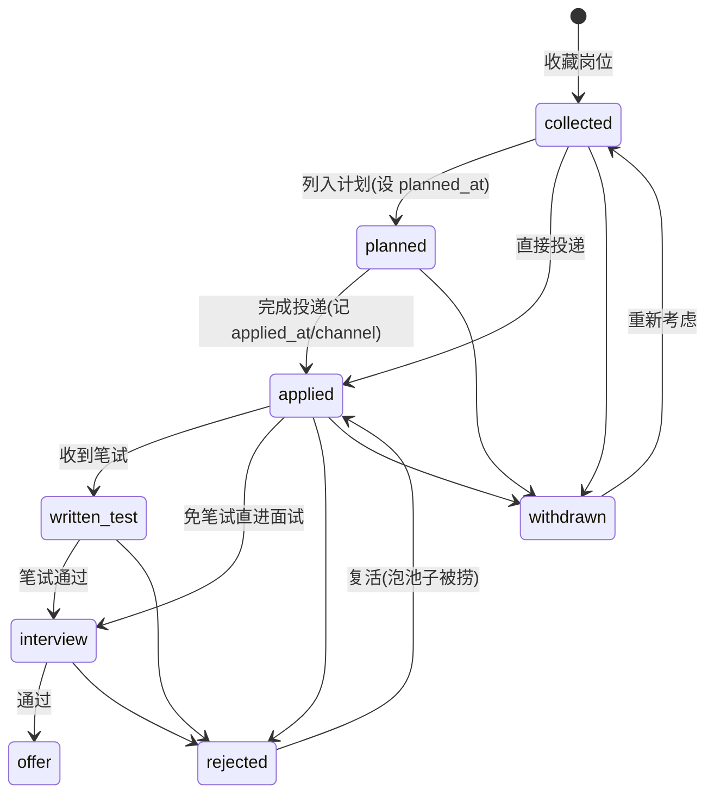

# JobRadar 数据模型

| 版本 | 日期 | 状态 |
|---|---|---|
| v0.1 | 2026-09-03 | 初稿 |

数据库：SQLite（WAL 模式），ORM：SQLAlchemy 2.0，迁移：Alembic（首版可 `create_all`，迁移工具 W2 引入）。

## 1. ER 图

```mermaid
erDiagram
    companies ||--o{ jobs : has
    jobs ||--o| applications : "0..1 (一人一岗一投)"
    applications ||--o{ application_events : history
    jobs ||--o{ match_reports : evaluated_by
    resumes ||--o{ match_reports : evaluates
    jobs ||--o{ recommendations : recommended_in
    crawl_sources ||--o{ jobs : discovered

    companies {
        int id PK
        text name UK
        text company_type   "internet|soe_central|soe_local|institute|bank|foreign|other"
        text tier           "dream|target|backup|none，用户目标分级"
        text homepage
        text notes
    }
    jobs {
        int id PK
        int company_id FK
        text title
        text jd_text
        text jd_summary     "LLM 摘要"
        text requirements_json  "结构化要求（LLM 提取）"
        text city
        text salary_range
        text source_platform
        text source_url
        text dedupe_hash UK
        date publish_date
        date deadline
        blob embedding      "float32 numpy"
        datetime created_at
    }
    applications {
        int id PK
        int job_id FK UK
        text stage
        text channel        "投递渠道"
        int priority        "1-5"
        date planned_at     "计划投递日"
        text next_action
        datetime next_action_at
        text notes
        datetime applied_at
        datetime created_at
    }
    application_events {
        int id PK
        int application_id FK
        text from_stage
        text to_stage
        text note
        datetime created_at
    }
    resumes {
        int id PK
        text name           "版本名，如 秋招v3-后端方向"
        text file_path
        text parsed_json    "结构化简历"
        blob embedding
        bool is_default
        datetime created_at
    }
    match_reports {
        int id PK
        int job_id FK
        int resume_id FK
        int score_total     "0-100"
        text detail_json    "硬性核对+维度分+缺口+建议"
        text model_used
        datetime created_at
    }
    recommendations {
        int id PK
        int job_id FK
        int match_report_id FK
        date rec_date
        int rank
        text reason         "一句话推荐理由"
        text status         "pending|accepted|ignored"
    }
    crawl_sources {
        int id PK
        text name
        text url
        text parser         "解析器标识"
        text category       "soe|institute|internet|community"
        bool enabled
        datetime last_crawled_at
        text meta_json      "站点特定配置"
    }
```

另有 `weekly_goals(week_start PK, target_count, note)` 与 `settings(key PK, value)` 两张小表支撑投递规划与配置。

## 2. 核心设计说明

### 2.1 jobs 与 applications 分离

- `jobs` 是**中立岗位库**：爬虫/插件/手动录入都只写 jobs，与用户行为无关。
- `applications` 是**我与岗位的关系**：仅当用户收藏/计划/投递时创建。`job_id` 唯一约束（单用户一人一岗一投；同公司不同岗位是不同 job）。
- 看板「收藏」列 = stage=collected 的 applications；「新发现」区 = 无 application 且近 48h 入库的 jobs。

### 2.2 去重

- `dedupe_hash = sha1(normalize(company_name) + normalize(title) + normalize(city))`
- normalize：去空白、全半角统一、公司名去后缀（有限公司/股份有限公司）、岗位名去括号备注。
- URL 不参与 hash（同岗位可能被多平台转载、URL 带追踪参数）。
- 爬虫/插件入库时撞 hash → 合并（补充 source_url 到 `meta_json` 的 `also_seen_on` 列表），不新建记录。

### 2.3 全文检索（FTS5）

```sql
CREATE VIRTUAL TABLE jobs_fts USING fts5(
    company_name, title, jd_text, city,
    content='jobs', content_rowid='id',
    tokenize='unicode61'      -- 写入/查询前用 jieba 分词并以空格连接
);
```

- 中文处理：写入侧与查询侧统一 jieba 分词（精确模式），空格拼接后交给 unicode61。
- 备选方案：`tokenize='trigram'`（SQLite ≥3.34 内置，无依赖；代价是 2 字查询词失配）。实现时先验证本机 SQLite 版本，两者取一，接口层屏蔽差异。
- 触发器保持 jobs_fts 与 jobs 同步（after insert/update/delete）。

### 2.4 向量存储

- `embedding BLOB`：numpy float32 序列化（1024 维 ≈ 4KB/条）。
- 检索：启动时懒加载全量到内存，`numpy` 矩阵乘算余弦，Top-K 截取。万条规模 < 100ms（见 architecture.md ADR-4）。
- embedding 生成时机：job 入库且 jd_text 非空时异步生成（任务队列，失败重试不阻塞入库）。

## 3. 投递状态机



**约定：**
- 流转不强制校验（允许跳阶段，如 collected → interview），但每次变更必须写 `application_events`（from/to/note/created_at）——**留痕是硬约束**。
- 终态：`offer` / `rejected` / `withdrawn`；终态可回退（泡池子复活是真实场景）。
- `next_action` + `next_action_at`：自由文本 + 时间，如「周三 19:00 前完成行测」，Dashboard/日历/提醒统一读这个字段。

## 4. 关键 DDL（节选）

```sql
CREATE TABLE companies (
    id INTEGER PRIMARY KEY AUTOINCREMENT,
    name TEXT NOT NULL UNIQUE,
    company_type TEXT NOT NULL DEFAULT 'other'
        CHECK (company_type IN ('internet','soe_central','soe_local','institute','bank','foreign','other')),
    tier TEXT NOT NULL DEFAULT 'none'
        CHECK (tier IN ('dream','target','backup','none')),
    homepage TEXT,
    notes TEXT,
    created_at DATETIME NOT NULL DEFAULT CURRENT_TIMESTAMP
);

CREATE TABLE jobs (
    id INTEGER PRIMARY KEY AUTOINCREMENT,
    company_id INTEGER NOT NULL REFERENCES companies(id),
    title TEXT NOT NULL,
    jd_text TEXT NOT NULL DEFAULT '',
    jd_summary TEXT,
    requirements_json TEXT,          -- {"hard": {...}, "skills": [...], "nice_to_have": [...]}
    city TEXT,
    salary_range TEXT,
    source_platform TEXT NOT NULL,   -- boss|niuke|guopin|official|extension|manual
    source_url TEXT,
    dedupe_hash TEXT NOT NULL UNIQUE,
    publish_date DATE,
    deadline DATE,
    embedding BLOB,
    is_active INTEGER NOT NULL DEFAULT 1,   -- 岗位下线置 0
    created_at DATETIME NOT NULL DEFAULT CURRENT_TIMESTAMP
);
CREATE INDEX idx_jobs_company ON jobs(company_id);
CREATE INDEX idx_jobs_deadline ON jobs(deadline) WHERE deadline IS NOT NULL;
CREATE INDEX idx_jobs_created ON jobs(created_at);

CREATE TABLE applications (
    id INTEGER PRIMARY KEY AUTOINCREMENT,
    job_id INTEGER NOT NULL UNIQUE REFERENCES jobs(id),
    stage TEXT NOT NULL DEFAULT 'collected'
        CHECK (stage IN ('collected','planned','applied','written_test','interview','offer','rejected','withdrawn')),
    channel TEXT,                    -- official|boss|niuke|email|referral|campus_talk
    priority INTEGER NOT NULL DEFAULT 3 CHECK (priority BETWEEN 1 AND 5),
    planned_at DATE,
    next_action TEXT,
    next_action_at DATETIME,
    notes TEXT,
    applied_at DATETIME,
    created_at DATETIME NOT NULL DEFAULT CURRENT_TIMESTAMP,
    updated_at DATETIME NOT NULL DEFAULT CURRENT_TIMESTAMP
);
CREATE INDEX idx_applications_stage ON applications(stage);
CREATE INDEX idx_applications_next_action ON applications(next_action_at) WHERE next_action_at IS NOT NULL;

CREATE TABLE application_events (
    id INTEGER PRIMARY KEY AUTOINCREMENT,
    application_id INTEGER NOT NULL REFERENCES applications(id),
    from_stage TEXT,
    to_stage TEXT NOT NULL,
    note TEXT,
    created_at DATETIME NOT NULL DEFAULT CURRENT_TIMESTAMP
);
CREATE INDEX idx_events_app ON application_events(application_id, created_at);

CREATE TABLE match_reports (
    id INTEGER PRIMARY KEY AUTOINCREMENT,
    job_id INTEGER NOT NULL REFERENCES jobs(id),
    resume_id INTEGER NOT NULL REFERENCES resumes(id),
    score_total INTEGER NOT NULL CHECK (score_total BETWEEN 0 AND 100),
    detail_json TEXT NOT NULL,       -- 见 agent-design.md §3.4 schema
    model_used TEXT NOT NULL,
    created_at DATETIME NOT NULL DEFAULT CURRENT_TIMESTAMP
);
CREATE INDEX idx_match_job ON match_reports(job_id, created_at DESC);
```

## 5. 数据量与容量预估

| 表 | 秋招季预估量级 | 说明 |
|---|---|---|
| jobs | 5k–20k | 爬虫每日新增几十至上百，插件收藏数百 |
| applications | 100–300 | 一个人一个秋招的投递上限 |
| application_events | ~1k | 每投递平均 3–5 次流转 |
| match_reports | 1k–3k | 粗筛 Top N 精评 + 手动触发 |
| embedding | ~20k × 4KB ≈ 80MB | 内存内检索可接受 |
